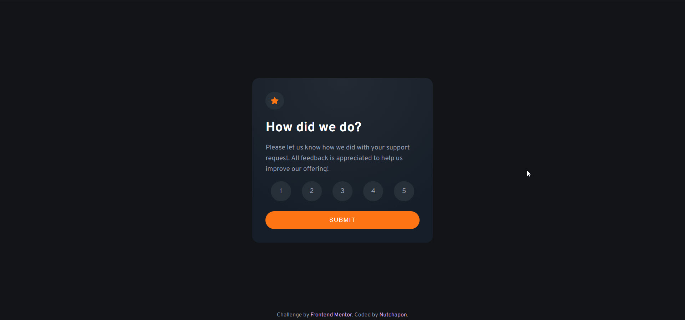
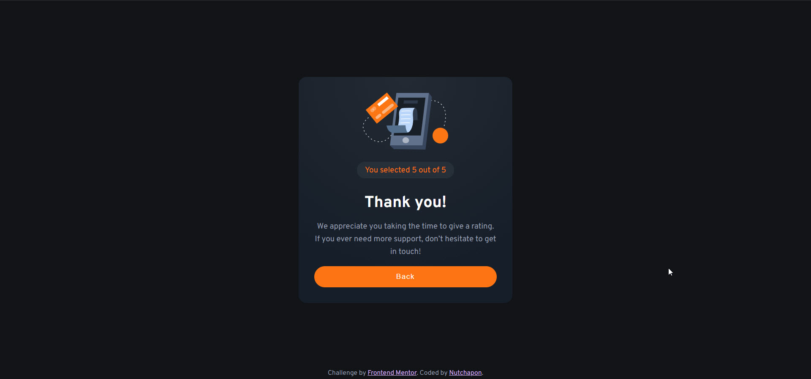

# Frontend Mentor - Interactive rating component solution

This is a solution to the [Interactive rating component challenge on Frontend Mentor](https://www.frontendmentor.io/challenges/interactive-rating-component-koxpeBUmI). Frontend Mentor challenges help you improve your coding skills by building realistic projects.

## Table of contents

- [Overview](#overview)
  - [The challenge](#the-challenge)
  - [Screenshot](#screenshot)
  - [Links](#links)
- [My process](#my-process)
  - [Built with](#built-with)
  - [What I learned](#what-i-learned)
  - [Continued development](#continued-development)
  - [Useful resources](#useful-resources)
- [Author](#author)

**Note: Delete this note and update the table of contents based on what sections you keep.**

## Overview

Interactive Rating Component built with React

### The challenge

Users should be able to:

- View the optimal layout for the app depending on their device's screen size
- See hover states for all interactive elements on the page
- Select and submit a number rating
- See the "Thank you" card state after submitting a rating

### Screenshot




### Links

- [Solution URL](https://github.com/NutchaponMake/interactive-rating-component)
- [Live Site URL](https://interactive-rating-component-c5c7-nutchaponmake.vercel.app/)

## My process

### Built with

- Semantic HTML5 markup
- CSS custom properties
- [Flexbox](https://css-tricks.com/snippets/css/a-guide-to-flexbox/)
- [React](https://reactjs.org/) - JS library

### What I learned

This project help me learn how to custom a input radio button and custom other style of it.

```css
.clear-default-input-radio-style {
  display: block;
  -webkit-appearance: none;
  appearance: none;
  background-color: var(--form-background);
}
```

### Continued development

May be adding a react-router , validation on score not equal to zero and more animated object in the future.

### Useful resources

- [Custom input radio button](https://moderncss.dev/pure-css-custom-styled-radio-buttons/) - This helped me for custom a input radio button type.

## Author

- Github - [Nutchapon](https://github.com/NutchaponMake)
- Twitter - [@SolanianNut](https://twitter.com/SolanianNut)
- Frontend Mentor - [@NutchaponMake](https://www.frontendmentor.io/profile/NutchaponMake)
